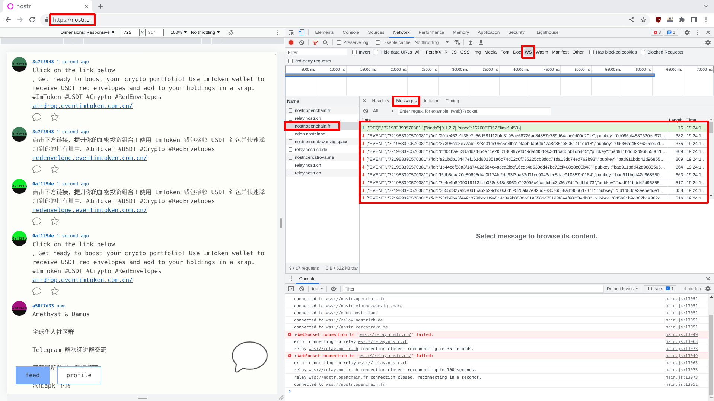
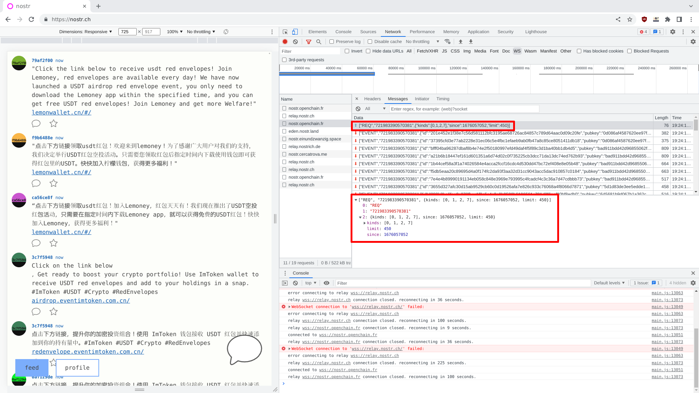
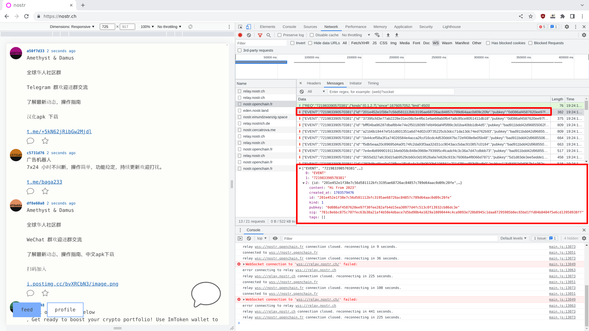
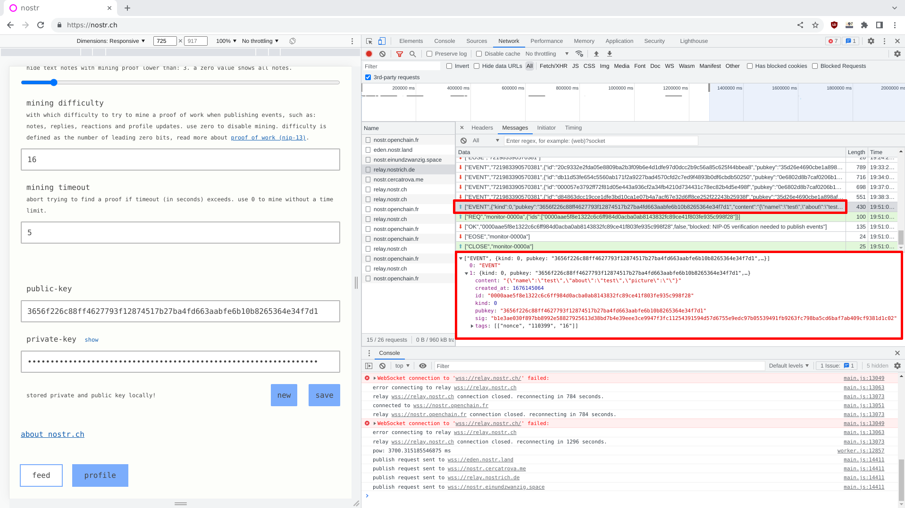
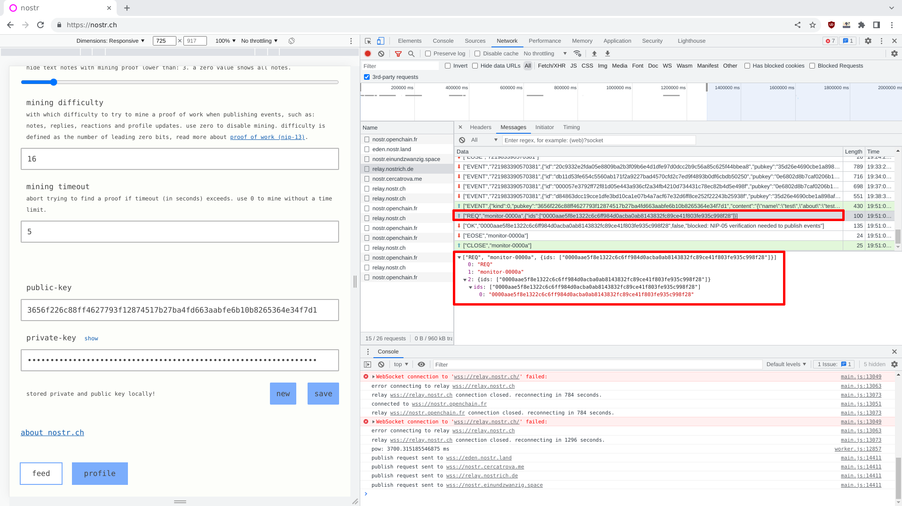
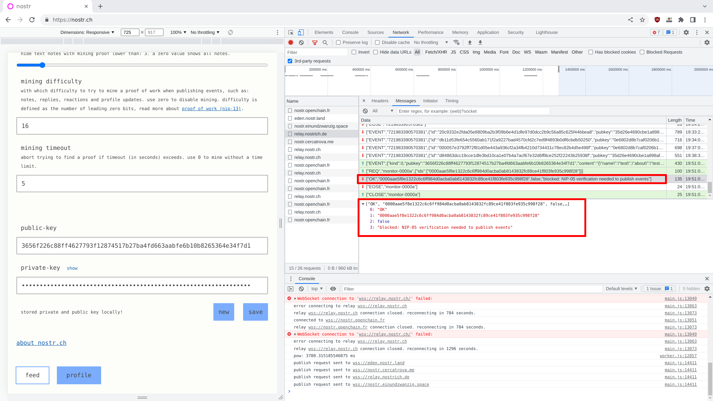
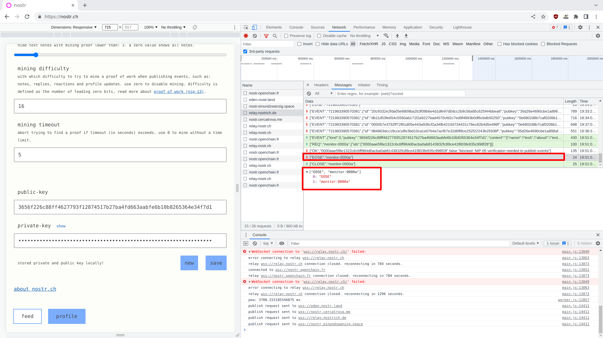
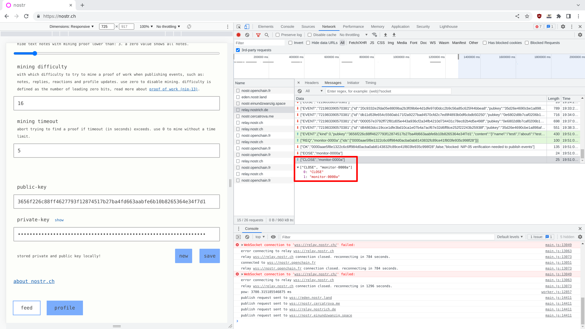

# An Introduction to nostr with Erlang

Erlang-Punch project started officially in December 2022, where many
small test recording were done. Unofficially, the project started in
September 2020 and was originally designed in March 2020...

The goal of the project has always been the same: find a way to share
experiences and knowledge between developers using Erlang in their
daily life or the people interested to use a high-available production
ready language. To make this objective possible, a true example, based
on standardized and modern standard was required.

From December 2022 to January 2023, an implementation of Gumbo using C
driver feature started. Unfortunately, the subject was perhaps a bit
too complex for the viewers. Indeed, writing code in C is quite
different than writing code in high level language like Erlang, and
requires both accuracy and focus. A wrong line of code or a wrong
pattern can break the virtual machine make even more dangerous, make
it unstable. It was definitively not the best thing to do, and could
lead to more confusion… or fear.

At the end of January 2023, after talking with people from Discord and
sharing old training supports with them, the idea of implementing a
real protocol appeared to be the correct solution, but which protocol
could be simple enough and interesting enough to be implemented? In
the past, [Whois](https://tools.ietf.org/html/rfc3912),
[IRC](https://www.rfc-editor.org/rfc/rfc1459.html) or even
[Gopher](https://www.ietf.org/rfc/rfc1436.txt) — in particular with
[Gemini](https://gemini.circumlunar.space/) — were presented during
training sessions, but they are old protocols, mainly used by
crypto-nerds around the world.

In February 2023, [Edward
Snowden](https://en.wikipedia.org/wiki/Edward_Snowden) posted a
[tweet](https://twitter.com/Snowden/status/1620789340199882752)
linking to nostr protocol, a new alternative to
[Twitter](https://twitter.com/) and
[Mastodon](https://en.wikipedia.org/wiki/Mastodon_(software)). If
someone ever reads Mastodon specification from
[Fediverse](https://en.wikipedia.org/wiki/Fediverse) and
[ActivityPub](https://en.wikipedia.org/wiki/ActivityPub), they
probably be afraid of the complexity of the whole protocol. Nostr
seems to be a [good and refreshing
alternative](https://github.com/nostr-protocol/nostr), using
cryptography at its core with simple, stable, efficient and trusted
solution like [JSON](https://en.wikipedia.org/wiki/JSON) and
[WebSocket](https://en.wikipedia.org/wiki/WebSocket).

## The History Behind Nostr Protocol

Before working on a project, it’s always good to know where we put our
feet. It looks like the creator of the project is
[Giszmo](https://github.com/Giszmo), and the first commiter of the
[official nostr repository](https://github.com/nostr-protocol/nostr)
was [Melvin Carvalho](https://github.com/melvincarvalho). To be
honest, the project is quite active and there is a lot of information
from many developers. It seems, though, the project was mainly
initiated by Bitcoin developers or people working closely to the
crypto-currency movement.

## Connecting to an Open Relay

Erlang did not directly offer a JSON parser or a WebSocket client in
its default release. Some good implementation in the community can be
used though: [Thoas](https://github.com/lpil/thoas) is a JSON parser
100% coded in Erlang; [Gun](https://github.com/ninenines/gun) is a
HTTP/1.1, WebSocket and HTTP/2 client made by the creator of the
[Cowboy](https://github.com/ninenines/cowboy) web server. With only
these two modules, it is possible to connect to a relay and fetch
some.

Before connecting the an open relay with Erlang, exploring the
protocol using Chrome or Firefox browsers could be nice. Indeed,
learning the hard way by doing reverse engineering like methodology
can lead to success and more: to excellence. Hacking the protocol is
always the best way to learn it. These screenshots have been taken
using [Iridium](https://iridiumbrowser.de/) — a Chromium fork without
Google stuff in it — running on OpenBSD-current and using the
[developer
mode](https://chromium.googlesource.com/chromiumos/docs/+/master/developer_mode.md)
usually available by pressing F12 key.



After the connection to the relay, a javascript client is loaded and
start by initializing websockets connections to different relays. In
this case.



When connected to the websocket, the client is sending a JSON list
asking for request, after sending this message, the relay is
forwarding events. Here the content of the request.

```json
["REQ","721983390570381",{"kinds":[0,1,2,7],"since":1676057052,"limit":450}]
```

At first glance, the client is asking for some data from a timestamp
with a defined limit. When reading
[NIP/01](https://github.com/nostr-protocol/nips/blob/master/01.md) we
understand a bit more the data-structure. The REQ request is asking
for new events from the relay. The second element of the list is a
subscription id — a random string — used to represent a
subscription. It seems this value is generated by the client. The
third element of the list is a JSON object containing the kind of
events requested. The kind “0” represents a
[`Metadata`](https://github.com/nostr-protocol/nips/blob/master/01.md),
the kind “1” represents a [“Short Text
Note”](https://github.com/nostr-protocol/nips/blob/master/01.md), the
kind “2” represents a [“Recommended
Relay”](https://github.com/nostr-protocol/nips/blob/master/01.md) and
the kind “7” represents a
[“Reaction”](https://github.com/nostr-protocol/nips/blob/master/25.md). The
“since” parameter is an UNIX timestamp representing a time limit for
the newer events. The “limit” parameter defines the limit of maximum
events returned by the relay.



When the REQ request is pushed by the client, the relay sent all the
events present on its side based on the parameters of the request. An
event looks like the following JSON list.

```json
["EVENT",
 "721983390570381",
 {
   "id":"201e452e1f38e7c56d581112bfc3195ae68726ac84857c789d64aac0d09c20fe",
   "pubkey":"0d086af4587620ee97f30fee282afb4d15ea30977d4fc513c0f13932cb86dc3e",
   "created_at":1703579476,
   "kind":1,
   "tags":[],
   "content":"Hi from 2023",
   "sig":"781c8ebbc875c707fec63b30a21af4b50e4dbace7d5bd90b4a1829a18090444c4ca9893e720b8945c1daa87295905b0ec65bd1ffd04b8404f5e6cd13958938ff"
 }
]
```

The second element of the list is corresponding to the same
subscription identified generated by the client. The third element is
a JSON object where “id” is a sha256 checksum of some part of the
payload — it’s defined in NIP/01 and will be generated in another
article. The “pubkey” is the public key of the emitter of the message,
the “created_at” is an UNIX timestamp, the “kind” define the type of
the event, the “tags” is a list of optional tags, the “content” field
is the content of the message sent by the emitter and finally, the
“sig” is the signature of the message, similar to the identifier.

By looking on these payloads, it is easy to recreate them using
Erlang. Even the connection should not be a real problem. After having
added the dependencies in rebar3 and started an Erlang shell, the gun
application can be started manually.

```
1> application:ensure_all_started(gun).
```

To create a new connection with Gun, a list of options need also to be
defined. In this case, Gun will try to create a connection to the
`relay.nostrich.de` relay, on port TCP/443. By default and without any
modification, the Erlang virtual machine is not configured with
SSL/TLS Certificate Authorities, disabling the verification of the
certificate could be helpful in this case. The goal is to have a
working procedure, not to do something perfect. The connection can be
created by using
[`gun:open/3`](https://ninenines.eu/docs/en/gun/2.0/manual/gun.open)
function.

```
2> Host = "relay.nostrich.de".
3> Port = 443.
4> Opts = #{ transport => tls, tls_opts => [{verify, verify_none}]}.
{ok, Pid} = gun:open(Host, Port, Opts).
```

If the connection has been correctly created, a new process identifier
was given. Gun needs to convert this HTTP connection to a WebSocket
one by using
[`gun:ws_upgrade/3`](https://ninenines.eu/docs/en/gun/2.0/manual/gun.ws_upgrade)
function.

```
5> Ref = gun:ws_upgrade(Pid, "/", []).
```

Crafting a new payload to request some kind of events. A new “REQ”
request can be crafted based on the previous pattern we extracted from
Chrome. The function
[`thoas:encode/1`](https://github.com/lpil/thoas/blob/main/src/thoas.erl#L75)
is used to convert a list of bitstring and map to the desired payload.

```
6> Payload = thoas:encode([
  <<"REQ">>,
  <<"8034879165223001">>,
  #{
    <<"kinds">> => [0,1,2,7],
    <<"since">> => 1675961097,
    <<"limit">> => 450
    }
]).
```

When the payload is ready, it can be sent to the WebSocket using
[`gun:ws_send/3`](https://ninenines.eu/docs/en/gun/2.0/manual/gun.ws_send)
function. This function will then forward all the message to the
process mailbox — the one used by the shell.

```
7> gun:ws_send(Pid, Ref, {text, Payload}).
```

To check the events collected, the local flush/0 function can be
called. A long list of message should be printed on your screen.

```
8> flush().
```

The procedure is working, and it is possible to retrieve the events on
public relay without creating any accounts, and by using only simple
modules available from Github.

## Key Pair Creation

The key creation is another level of complexity. It will be solved in
another article, but process seems also relatively easy to
understand. The following screenshots explain it with a new key
created on a browser and pushed to one open relay.



```json
["EVENT",
 {
   "kind":0,
   "pubkey":"3656f226c88ff4627793f12874517b27ba4fd663aabfe6b10b8265364e34f7d1",
   "content":"{\"name\":\"test\",\"about\":\"test\",\"picture\":\"\"}",
   "tags":[
     ["nonce","110399","16"]
   ],
   "created_at":1676145064,
   "sig":"b1e3ae030f897bb8992e58827925613d38bd7b4e39eee3ce9947f3fc11254391594d57d6755e9edc97b05539491fb9263fc798ba5cd6baf7ab409cf9381d1c02",
   "id":"0000aae5f8e1322c6c6ff984d0acba0ab8143832fc89ce41f803fe935c998f28"
 }
]
```



```json
["REQ","monitor-0000a",{"ids":["0000aae5f8e1322c6c6ff984d0acba0ab8143832fc89ce41f803fe935c998f28"]}]
```



```json
["OK","0000aae5f8e1322c6c6ff984d0acba0ab8143832fc89ce41f803fe935c998f28",false,"blocked: NIP-05 verification needed to publish events"]
```



```json
["EOSE","monitor-0000a"]
```



```json
["CLOSE","monitor-0000a"]
```

## Conclusion

Actor model was designed for Events Oriented Programming, by chance,
Erlang is an implementation of the actor model. In few lines of code,
without using a lot of experience and simply with some 101 reverse
engineering skill, it is possible to extract events from a public
relay. That’s a great beginning, and the first summary of a long story
at Erlang-Punch.

See you soon!

PS: this article has been published on
[substack](https://erlangpunch.substack.com/p/an-introduction-to-nostr-with-erlang).

# References and Resources

 - [OpenBar#23/06 - Exercism (compte bancaire) et nostr](https://www.youtube.com/watch?v=4wMedr4k8zM)
 - NIPS: https://github.com/nostr-protocol/nips/blob/master/README.md
 - NIP01: https://github.com/nostr-protocol/nips/blob/master/01.md
 - Gun Source code: https://github.com/ninenines/gun/blob/master/src/gun.erl
 - Gun Manual: https://ninenines.eu/docs/en/gun/1.3/manual/gun.ws_send/
 - Erlang SSL/TLS options: https://www.erlang.org/doc/man/ssl.html#type-client_option
 - Web Socket Debugging with Chrome: https://tutorial.mtyiu.site/csci4140-spring15/tutorials/9/ws-debug/
 - Thoas Source code: https://github.com/lpil/thoas
 
