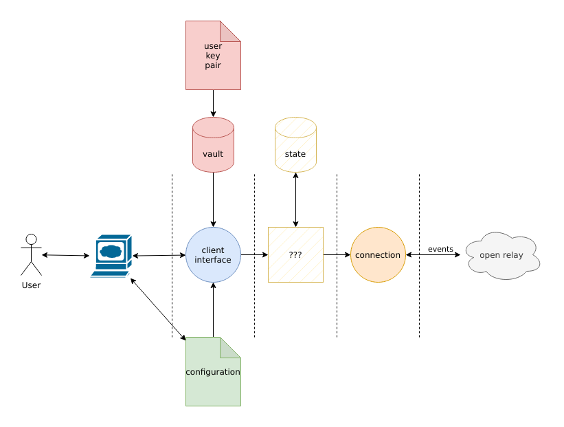
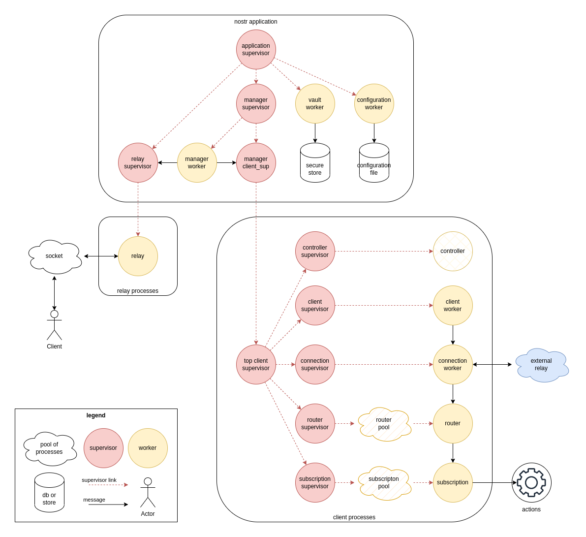

# Implementating nostr Client in Erlang

The previous article was a bit messy, and was just there to present a
way to understand nostr protocol using a browser like Chromium or
Firefox by only using the developer console they provide. By using
this method, anyone with a bit of experience in development can easily
understand how the protocol works and what kind of data are being
exchanged.

Erlang was made with this notion "observability" in mind, if you
remember correctly, Joe Armstrong taked about reproducing a protocol
by looking at its raw content on the network. The way this article is
created and the way the nostr Erlang project is conducted is the same.


This new article, though, will try to explain and resume how to
implement a first version of a nostr client, not by hacking it with a
browser this time, but by crafting something from scratch. A long part
of this article will also explain the role of designing and specifying
the internal interfaces, mainly used by developers for the moment.

## Designing

Sometimes, it's better to start with a diagram, something everyone can
understand easily, even if you don't have any experience with the
language. The terms used should also be defined -- when the definition
is available.



An open relay is a remote server, one we can reach and connect to send
and receive events. At this time, this platform is not managed by
someone we know and no one has access to the configuration. This
server is already offering an interface to the client, using HTTP and
WebSocket. During all the test, `relay.nostrich.de` open relay will be
used.

A connection will be generated from the client side and will be
created using the [Erlang HTTP client
Gun](https://github.com/ninenines/gun) available as external
dependency.

The main application containing all the business logic and all the
complexity is not known at this time. Some states will be required to
be stored somewhere for example, but, this is not the priority.

The client interface will be the common interface used by CLI, GUI or
WebUI. It should be simple enough to avoid confusion and well
documented to be used by anyone interested to use this application.

A vault - a secure place - will be required to store confidential
information like cryptographic key pairs. This place will be encrypted
and protected.

A configuration will be also required, to define the behavior of the
whole application. Different way can be used, a simple text file or
environment variables for example.

## Development Platform and Tests

To have a successful project, it's mandatory to have all the tools to
automatically test, build, release and all the assets provided by the
application. A good platform is also required to build as fast as
possible. This new implementation will use [Github
Actions](https://docs.github.com/en/actions) by before enabling this
feature, it is required to prepare the developer environment with
[`rebar3`](http://rebar3.org/).

### Dependencies

No one wants to deal with the issues you can encounter when you are
using a new version of an application, even more when you need to
develop something from scratch. That's why the project will currently
lock everything until something is working. The minimum Erlang/OTP
version used will be [R25](https://www.erlang.org/downloads/25). All
these parameters are being added in `rebar.config` file.

```erlang
{minimum_otp_vsn, "25.0"}.
```

Regarding external dependencies, `cowboy` will be locked to version
[`2.9.0`](https://ninenines.eu/docs/en/cowboy/2.9/guide/), `gun` will
be locked to version
[`2.0.0`](https://ninenines.eu/docs/en/gun/2.0/guide) and `thoas` will
be locked on the version
[`1.0.0`](https://github.com/lpil/thoas/releases/tag/v1.0.0).

```erlang
{deps, [{cowboy, "~> 2.9.0"}
       ,{gun, "~> 2.0.0"}
       ,{thoas, "~> 1.0.0"}
]}.
```

To help developers, a `.tool-versions` file has been created and can
be used with [`asdf`](https://asdf-vm.com/) to bootstrap automatically
your environment with good versions. The Erlang version is fixed there
to [`25.1.2`](https://www.erlang.org/news/158) and rebar3 to 3.20.0.

```
erlang 25.1.2
rebar 3.20.0
```

This part of the development is important, softwares are moving fast,
and because the current project is small, the time is precious. Every
time a new version is released, new features and new bugs are also
released as well. By already fixing the versions and only upgrading
them when a bug is found, it will give us the opportunity to stay
focus on the objectives.

### Compiler

Dealing with compiler is painful, even in Erlang. That's why the nostr
project will configure these parameters right now and force the
developers to produce strict code. These parameters are being added in
`rebar.config` file present at the root of the project and can be
found in the official Erlang compiler documentation.

```erlang
{erl_opts, [debug_info
           ,deterministic
           ,warnings_as_errors
           ,warn_missing_spec
           ,verbose
           ,compressed
]}.
```

Until the application is working and stable, the `debug_info`
parameter will stay here. The project wants to offer a deterministic
way to build release and binaries, that's why `deterministic` option
has been added. All warnings must be treated as errors and fixed
before merging it in `main` branch, `warnings_as_errors` has been
added accordingly. `warn_missing_spec` has been added to be sure every
exported functions have specifications, helpful to design and to show
how a function is working to a developer. Then the `verbose` options
has been added to have more information during build. Finally
`compressed` option has been added to reduce the size of the binaries.

### Testing

It's always nice to have aliases that could help develoeprs in their
daily job. An alias is helpful to execute the same list of commands
everywhere and then, be also integrated in the continuous integration
process. A `check` alias has been created to execute automatically all
test commands. This alias is also using the Github Workflow as well.

```erlang
{alias
,[{check
  ,[{eunit, "--cover --verbose --profile"}
  ,{ct, "--cover --verbose"}
  ,{cover, "--verbose"}
  ,edoc
  ]}
]}.
```

[`eunit`](https://www.erlang.org/doc/apps/eunit/chapter.html) is
mainly used to create test unit, in this project, for the moment, it
is also used to design the different interfaces. This application is
called using `--cover` flag to enable the coverage, `--verbose` flag
to be more verbose and `--profile` flag to enable the profiling,
useful to check the performance of the whole project - or at least
tested functions.

[`ct`](https://www.erlang.org/doc/man/common_test.html#)
(`common_test`) is used to validate the whole running platform and
also used for regression test. At this time of writing, this part of
the code is empty but will be improved very soon. This application is
called with `--cover` flag to enable the coverage and `--verbose` to
have more information during the execution of the tests.

[`cover`](https://www.erlang.org/doc/man/cover.html#) prints a report
of the whole coverage, it has been added to be part of the continuous
integration process. It gives a good view of the stability of the
project.

The last command used is
[`edoc`](https://www.erlang.org/doc/apps/edoc/users_guide.html) and
mainly used to generate the documentation. The options are provided
directly in `rebar.config` file.

### Documenting

Using [literate programming
would](https://en.wikipedia.org/wiki/Literate_programming) have been
really great, but Erlang/OTP is not currently supporting this kind of
method. So, instead of having a code from the documentation, the
documentation will be added directly when needed. Every piece of code
should be documented, why? Because it's an educational project and it
should be clear enough to be understood by the majority of people. All
the following parameters are defined in `rebar.config` file.

```
{edoc_opts,
  [{preprocess, true}
  ,{private, true}
  ,{new, true}
  ,{todo, true}
  ,{report_missing_types, true}
  ,{link_predefined_types, true}
  ,{includes, ["include"]}
]}.
```

Now, the documentation can be generated using [`rebar3
edoc`](https://www.rebar3.org/docs/commands/#edoc) command, the
documentation will be stored in `doc` directory.xm

## Crafting

The tools to automatically test and document are now ready, it is
possible to generate easily all the assets needed with only one
command, and it is automatically executed on a remote worker when the
code is pushed on Github. It's time to code and craft the
application. Because a project can be done in so many ways, the
following sections are considered like simple notes to explain the
process used.

### Speciying

Specifying the type of data used is quite important for a
project. When you have the right data-structure, the code will be
easier to maintain and algorithms will be easier to understand. Even
more, someone will be able to check the code produced with a static
analysis tool like
[dialyzer](https://www.erlang.org/doc/man/dialyzer.html) and/or
[cuter](https://github.com/cuter-testing/cuter).

A nostr `event` message can be represented a `record` containing
specific types of data. 

```erlang
-type event_id() :: undefined | bitstring().
-type public_key() :: bitstring().
-type created_at() :: pos_integer().
-type kind() :: pos_integer().
-type tag() :: [bitstring(), bistring(), bitstring()].
-type tags() :: [tag(), ...].
-type content() :: bitstring().
-type signature() :: bitstring().

-record(event, { id :: event_id()
               , public_key :: public_key()
               , created_at :: created_at()
               , kind :: kind()
               , tags :: tags()
               , content :: content()
               , signature :: signature()
               }).
-type event() :: #event{signature :: signature()}.
```

A nostr `filter` message can be represented as a `record` as well.

```erlang
-type event_ids() :: [event_id(), ...].
-type prefix() :: bitstring().
-type author() :: public_key() | prefix().
-type authors() :: [author(), ...].
-type kinds() :: [kind(), ...].
-type tag_event_ids() :: event_ids().
-type tag_event_public_keys() :: [public_key(), ...].
-type since() :: pos_integer().
-type until() :: pos_integer().
-type limit() :: pos_integer().

-record(filter, { event_ids :: event_ids()
                , authors :: authors()
                , kinds :: kinds()
                , tag_event_ids :: tag_event_ids()
                , tag_public_keys :: tag_event_public_keys()
                , since :: since()
                , until :: until()
                , limit :: limit()
                }).
-type filter() :: #filter{limit :: limit()}.
```

A `request` message representation.

```erlang
-type subscription_id() :: bitstring().

-record(request, { subscription_id :: subscription_id()
                 , filter :: filter()
                 }).
-type request() :: #request{filter :: filter()}.
```

A `close` message representation.

```erlang
-record(close, { subscription_id :: subscription_id() }).
-type close() :: #close{subscription_id :: subscription_id()}.
```

A `notice` message representation.

```erlang
-type message() :: bitstring().
-record(notice, { message :: message() }).
-type notice() :: #notice{message :: message()}.
```

Those types will be available in `nostrlib_decoder.hrl` for the
moment. This is a big draft, so, it will change in a near future.

### Supervision Tree

A "client" in this context is not a simple process but a group of
processes. Each one doing one task well. That's the
[Unix](https://en.wikipedia.org/wiki/Unix_philosophy)/[KISS](https://en.wikipedia.org/wiki/KISS_principle)
philosophy. Because the project is starting, this group of processes
will probably need to change and evolve during the next
iteration. Here a diagram representing the supposed supervision tree
at this time of writing (some of the processes there are not currently
implemented).




A client needs to manage a connection to a relay, and it will be done
by `nostr_client_connection` process.

A client needs to decode/encode (parseing) the data coming from the
relay and the message sent to the relay from the client. This part of
the code will be executed by a pool of `nostr_client_router`
process. They will be in charge to parse, convert, validate and check
the messages.

A client will probably also have subscriptions. Like the routers, a
pool of subscription process will be created, where one subscription
process will deal with one subscription. This part of the code will be
execute with the `nostr_client_subscription` module.

Finally, two others processes need to be present, a "client" to send
messages to the relay by using directly the connection or reusing the
pool of routers and a `controller` to manage the whole group of
process used by the client itself. 

This diagram is mainly a draft and will evolve when deployed and
used. The supervisor tree is quite complex for the moment, but it will
offer a bit of flexibility, it is possible to start a process on
different layer and will probably help when new features will be
added.

### Library Modules

A library is always required when a new protocol is implemented. A
library is the place where all magic happens. In this particular case,
and until something stable is found, 3 libraries will be created, one
for the client called `nostrlib_client`, one for the relay called
`nostrlib_relay` and another with common client/relay features called
`nostrlib`.

At the end, all features will probably be merged in `nostrlib` file
and offered as an external library to help other project to use the
same patterns.

### Client Connection Module

The first version of the connection module should be simple and use a
`gen_server` behavior. Using a `gen_statem` behavior could help a lot
here though. A connection can have at least 2 states, `connected` or
`disconnected`. By default a connection can be created when reading
the configuration file and should be set to `disconnected` by default,
waiting for the user to create the connection.

A connection is responsible to forward the events to the correct
subscriptions and to send the events message to the remote relay. It
assumes the data were already correctly formatted.

A connection is also responsible to parse and valid the message coming
from the relay by offering a high level abstraction on all messages.

```erlang
% create a new connection
{ok, Connection} = nostr_client_connection:start([
    {host, "relay.nostrich.de"}
]).

% stop an existing connection
ok = nostr_client_connection:stop(Connection).
```

This application is supervised by `nostr_client_connection_sup` and
should also be started when this supervisor is started.

```erlang
{ok, SupervisorPid} = nostr_client_connection_sup:start_link([
    {host, "relay.nostrich.de"}
]).
```

### Client Router Module

Like previously described, a router module will be in charge to
translate and validate the data coming from the relay and from the
client. It currently uses a simple `gen_server` behavior matching the
cast messages.

```
{ok, RouterPid} = nostr_client_router:start([
    {host, "relay.nostrich.de"}
]).
```

Because this process can crash, a pool of router is required. The
`nostr_client_router_sup` will be in charge to start more than 1
router, all present in a [process group
(pg)](https://www.erlang.org/doc/man/pg.html#).

```erlang
{ok, RouterSupPid} = nostr_client_router_sup:start_link([
    {host, "relay.nostrich.de"}
]).
```

To send a message to one router used by a specific client, the
function `nostr_client_router:send_pool/2` has been created. The first
argument is using the identifier of the client (at this time the
hostname) and the second argument is the message.

```erlang
Data = <<"my data">>.
ok = nostr_client_router:send_pool("relay.nostrich.de", Data).
```

The router module is currently a working draft, and will be improved
in a near future. A pool of shared router could also be another idea,
instead of dedicated one pool to one client, a shared pool could be
used by all the processes on the platform, but it will be necessary to
send also some headers (with the client id for example) to correctly
routes the messages.

### Client Subscription Module

The subscription module is currently a work in progress. A
subscription should be created on demand by the user, using different
kind of filters. A subscription id is a random string shared with the
relay, and will be used to identify one subscription process couple
with the hostname of the relay.

```
{ok, SubPid} = nostr_client_subscription:start([
    {host, "relay.nostrich.de"}
]).
```

A subscription process is supervised by the
`nostr_client_subscription_sup` supervisor. By default, no
subscription process is started.

```
{ok, SubscriptionSupPid} = nostr_client_subscription_sup:start_link([
    {host, "relay.nostrich.de"}
]).
```

## Validation

Before merging the code in `main` branch, a `check` is needed.

```sh
rebar3 check
```

Everything is fine? Then it's time to test this application by
executing a shell and start commands one by one.

```sh
rebar3 shell
```

First, the application nostr must be started, with all the mandatory
children under the top application supervisor.

```erlang
1> supervisor:which_children(nostr_sup).
[{{nostr_pg,relay},<0.220.0>,worker,[pg]},
 {{nostr_pg,client},<0.219.0>,worker,[pg]},
 {nostr_manager,<0.218.0>,worker,[nostr_manager]},
 {nostr_manager_sup,<0.215.0>,supervisor,[nostr_manager_sup]}
]
```

Great! Next, `nostr_manager_sup` supervisor should have two children,
one to supervise the clients and another one to supervise the relays.

```erlang
2> supervisor:which_children(nostr_manager_sup).
[{nostr_manager_relay_sup,<0.217.0>,supervisor, [nostr_manager_relay_sup]},
 {nostr_manager_client_sup,<0.216.0>,supervisor,[nostr_manager_client_sup]}
]
```

It looks like these processes are up and running. Neat. Then, the next
step is to create a fully new client, the target will be
`relay.nostrich.de`.

```erlang
3> nostr_manager_client_sup:start_client_sup([{host, "relay.nostrich.de"}]).
=INFO REPORT==== 25-Feb-2023::06:05:42.981329 ===
{nostr_client_connection,<0.243.0>,init,
[{host,"relay.nostrich.de"}],
{state,<0.244.0>,
#Ref<0.3167004871.2882535425.170808>,#{},
[{host,"relay.nostrich.de"}],
false,false}}
{ok,<0.227.0>}

=DEBUG REPORT==== 25-Feb-2023::06:05:43.937505 ===
{nostr_client_connection,<0.243.0>,info,
{gun_up,<0.244.0>,http},{state,<0.244.0>,
#Ref<0.3167004871.2882535425.170808>,#{},
[{host,"relay.nostrich.de"}],
false,false}}

=DEBUG REPORT==== 25-Feb-2023::06:05:44.022120 ===
{nostr_client_connection,<0.243.0>,info,
{gun_upgrade,<0.244.0>,
#Ref<0.3167004871.2882535425.170808>,
[<<"websocket">>],
[{<<"server">>,
    <<"nginx/1.18.0 (Ubuntu)">>},
    {<<"date">>,
    <<"Sat, 25 Feb 2023 06:05:44 GMT">>},
    {<<"connection">>,<<"upgrade">>},
    {<<"upgrade">>,<<"websocket">>},
    {<<"sec-websocket-accept">>,
    <<"sWkI2DKeHYrYjvVY9MIxBnubWrw=">>}]},
{state,<0.244.0>,
#Ref<0.3167004871.2882535425.170808>,#{},
[{host,"relay.nostrich.de"}],true,false}}
```

The connection looks good, the debug functions are correctly printing
the information we need. Before creating a subscription, the routers
need to be controlled. At this time, a client is using only the
targeted host as ID.

```erlang
4> pg:get_members(client, {"relay.nostrich.de", router}).
[<0.240.0>,<0.239.0>,<0.238.0>,<0.237.0>,<0.236.0>,
 <0.235.0>,<0.234.0>,<0.233.0>,<0.232.0>,<0.231.0>]
```

The routers are available, ready to receive messages from the
connection. Now, is there a connection available in the client group?

```erlang
5> [ConnectionPid] = pg:get_members(client, {"relay.nostrich.de", connection}).
[<0.243.0>]
```

Yes! Now it's the time to craft the subscription and see the messages
flowing to the routers and being printed to the screen.

```erlang
6> Subscription = nostrlib_client:create_subscription_id().
<<"1548020009695083135">>

7> Req = [<<"REQ">>, Subscription, #{kinds => [0,1],limit => 3}].
Req = [<<"REQ">>, Subscription, #{kinds => [0,1],limit => 3}]

8> nostr_client_connection:send_raw(ConnectionPid, thoas:encode(Req)).
=DEBUG REPORT==== 25-Feb-2023::12:44:09.550374 ===
{nostr_client_router,<0.315.0>,parsed,
    {ok,{subscription,<<"17771556064953075220123">>,
            {event,
                <<"a1e07351da91f38fd993f5d27e09e3ec5f353353d8d38c26a8e52d86d39d3526">>,
                <<"198ae429b4fdfb7ad0d05c6877c3b2c7db5aedfff9794682fc52fd50e8cee27a">>,
                1677329036,0,[],
                <<123,34,108,117,100,49,54,34,58,34,103,117,110,110,97,114,64,
                  115,116,97,99,107,101,114,46,110,101,119,115,34,44,34,97,98,
                  111,117,116,34,58,34,35,66,105,116,99,111,105,110,32,109,111,
                  117,110,116,97,105,110,32,109,97,110,34,44,34,110,105,112,48,
                  53,34,58,34,103,117,110,110,97,114,64,115,116,97,99,107,101,
                  114,46,110,101,119,115,34,44,34,119,101,98,115,105,116,101,
                  34,58,34,109,121,114,97,98,98,105,116,104,111,108,101,115,
                  116,111,114,121,46,99,111,109,34,44,34,112,105,99,116,117,
                  114,101,34,58,34,104,116,116,112,115,58,47,47,110,111,115,
                  116,114,46,98,117,105,108,100,47,105,47,110,111,115,116,114,
                  46,98,117,105,108,100,95,102,50,98,51,99,97,52,101,56,56,48,
                  54,56,56,52,48,99,55,100,57,55,98,102,101,98,98,102,98,48,99,
                  49,98,100,102,52,57,56,56,51,100,97,102,52,55,100,97,101,54,
                  51,48,99,50,55,97,97,98,102,48,49,99,98,97,51,97,46,112,110,
                  103,34,44,34,100,105,115,112,108,97,121,95,110,97,109,101,34,
                  58,34,71,117,110,110,97,114,226,154,161,239,184,143,34,44,34,
                  100,105,115,112,108,97,121,78,97,109,101,34,58,34,71,117,110,
                  110,97,114,226,154,161,239,184,143,34,44,34,98,97,110,110,
                  101,114,34,58,34,104,116,116,112,115,58,47,47,110,111,115,
                  116,114,46,98,117,105,108,100,47,105,47,110,111,115,116,114,
                  46,98,117,105,108,100,95,55,97,50,55,100,52,101,99,57,100,
                  102,52,52,52,54,57,51,54,102,99,52,57,99,50,56,98,54,53,98,
                  52,48,51,101,52,56,50,102,49,53,52,49,48,97,98,99,53,49,52,
                  98,48,56,56,56,101,54,101,99,57,54,54,99,52,101,49,46,106,
                  112,103,34,44,34,108,117,100,48,54,34,58,34,34,44,34,110,97,
                  109,101,34,58,34,71,117,110,110,97,114,34,44,34,117,115,101,
                  114,110,97,109,101,34,58,34,71,117,110,110,97,114,34,44,34,
                  110,105,112,48,53,118,97,108,105,100,34,58,116,114,117,101,
                  125>>,
                <<"9ceb379928218752158f63db93233abeccd96550d711e341ed721677656866f2313e0119d7ac5d18d43599d229770613dd2830e8d184f45b1fa1661f7343e83b">>}}},
    {state}}
```

The messages are correctly forwarded to the routers. The first part of
client is practically ready and can, at least, be used for doing more
test.

## Conclusion: Testing, Failing, Improving and Do It Again

What makes Erlang a great language is all the high level abstraction
behind the scene, where all processes (actors) are interacting
together, sending messages, crashing and being restarted when
needed.

Explaining step by steps how to design an application from scratch
without knowing the protocol is always a complex task though. The idea
is to try and fail, then modify the way it has been implemented until
the implementation fit your needs.

During the first part of the implementation, everything will move,
from the data-structures to the algorithms and the global structure of
the application. Don't worry, the application is not used by someone
else, it is not used in production, so, that's the best moment to
improve and break things.

# References and Resources

 - [LiveCoding#23/07 - Nostr Client Implementation in Erlang](https://www.youtube.com/watch?v=oxq4Zz5h3no)
 - [OpenBar#23/07 - Erlang 26.0.0rc1, Design et Implementation de nostr en Erlang](https://www.youtube.com/watch?v=BvImrjkBlEE)
 - [LiveCoding#23/08 - Nostr Client Implementation in Erlang](https://youtu.be/D2KzB2e3mJI)
 - [OpenBar#23/08 - Implementation d'un client nostr en Erlang](https://youtu.be/yO70FZHj-6Q)
