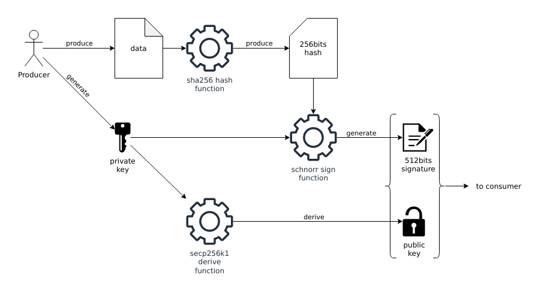
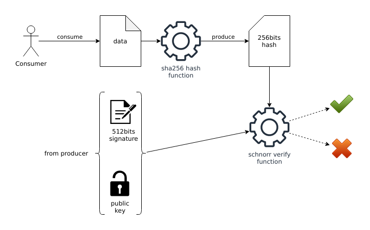

---

This article has been redacted in February and March 2023. It
describes the methodologies applied and describe the methods used to
implement the first NIP from `nostr` protocol in Erlang with a minimal
amount of dependencies. The following code has been tested using
[Erlang/OTP R25](https://www.erlang.org/news/157) running on
[OPENBSD-72-CURRENT](openbsd.org/) and [Parrot
Linux](https://parrotsec.org/) (a Debian like distribution). 


# Schnorr Signature in Pure Erlang

Erlang is a multi-purpose language using its own virtual machine
called the BEAM [^wikipedia-beam] -- a short name for Bogdan's Erlang
Abstract Machine -- and greatly inspired by the Warren Abstract
Machine [^wikipedia-wam] (WAM). It was created to help creating
distributed enviroment. Usually, low level languages are used to
implement cryptographic functions, this article will show its possible
to have decent performances with great features when using high level
languages.

The first Schnorr signature scheme designed for Bitcoin
[^wikipedia-bitcoin] was defined in BIP-0340
[^bip-0340-specification]. This scheme can also be found in BIP-0341
[^bip-0341-specification] and BIP-0342 [^bip-0342-specification]
specifications. The implementation reference was made in Python
[^bip-0340-implementation] [^bip-0340-test-vectors].

Schnorr signature [^wikipedia-schnorr-signature] -- likes any other
cryptographic scheme -- is hard to implement. Fortunately, because
Bitcoin is used by lot of people around the world, this signature
protocol has been explained many times and anyone can find interesting
resources on this topic [^youtube-christof-paar-ecc]
[^youtube-pieter-wuille-schnorr]
[^youtube-cihangir-tezcan-schnorr-multi-signature]
[^youtube-bill-buchanan-schnorr] [^youtube-theoretically] without
buying a single book.

## Collecting Information

Starting with a small overview [^weboftrust-schnorr-signature], Schnorr
signature scheme seems to have a strong security proofs, to be simple,
to be fast and to have the property to create secrets without
additional exchange.

Many implementation of this scheme can be found out there, in C
[^c-libecc] [^c-cschnorr], C++ [^cpp-schnor], Elixir [^elixir-k256]
[^elixir-bitcoinex] [^elixir-bitcoinex-schnorr], Go
[^go-schnorr-signature], Python [^python-schnorr-example]
[^python-taproot] [^python-solcrypto], Java [^java-samourai-schorr] or
Javascript [^javascript-schnorr] [^nodejs-schnorr-signature].

## Implementing Schnorr Signature Scheme

Like previously said, the reference implementation was made in
Python. This language is not using the same paradigm than Erlang,
Python is a script-like language using oriented object programming,
while Erlang is a distributed and functional programming language. The
way the code will be created will be quite different, and will require
small adaptation. Modulo operator and `pow` functions are, for
example, not the same in these two universes. Functions with same
behaviors than these two will need to be created on the Erlang side, a
dedicated section for each of them will be available in this part of
the article.

Dealing with asymetric cryptography -- even more elliptic curves --
can be quite complex and a well designed interface should avoid even
smallest frictions with the developers. Functions to create standard
and secure keys should be available. In this implementation, the
`nostrlib_schnorr:new_privatekey/0` will be a wrapper of the
[`crypto:generate_key/2`](https://www.erlang.org/doc/man/crypto.html#generate_key-2)
function. A secp256k1 private key a 32bytes (256bits) random number
and could also have been generated using
[`crypto:strong_rand_bytes/1`](https://www.erlang.org/doc/man/crypto.html#strong_rand_bytes-1)
function as well but we are assuming the functions provided by the
Erlang team in [`crypto`](https://www.erlang.org/doc/man/crypto.html)
module are already doing all the validation and are configuring the
recommended parameterss [^secp256k1-recommended-parameters].

```erlang
% generate a private key using crypto:generate_key/2
{_PublicKey, <<PrivateKey:256/bitstring>>}
    = crypto:generate_key(ecdh, secp256k1).

% generate a private key using crypto:strong_rand_bytes/1
<<PrivateKey:256/bitstring>> 
    = crypto:strong_rand_bytes(32).

% generate a private key using nostrlib_schnorr:new_private_key/0.
{ok, <<PrivateKey:256/bitstring>>} 
    = nostrlib_schnorr:new_private_key().
```

A public key, derived from the private key, is also required. The one
provided by
[`crypto:generate_key/2`](https://www.erlang.org/doc/man/crypto.html#generate_key-2)
is not suitable for our needs. A specific point on the curve is
required and defined in BIP-0340, an operation on this same point is
also required. The function to generate a public key with `nostrlib`
is `nostrlib_schnorr:new_publickey/1`, where the first and only
argument to pass is a valid private key (32bytes length bitstring).

```erlang
{ok, <<PublicKey:256>>} 
    = nostrlib_schnorr:new_public_key(PrivateKey).
```

The Schnorr signature scheme can only sign 32bytes (256bits) messages,
the BIP-0340 specification uses SHA256 as main hashing function to
produce a 256bits fixed length hash as message. The `crypto` module
offers the function
[`crypto:hash/2`](https://www.erlang.org/doc/man/crypto.html#hash-2)
to generate this payload, where the first argument will be the atom
`sha256` and the second argument will be the content to hash. This
value can be signed by the functions `nostrlib_schnorr:sign/2` or
`nostrlib_schnorr:sign/3` where the first argument is the hash
previously generated and the second argument is the private key. The
signature returned is a 64bytes (512bits) fixed length bitstring.

```erlang
% create a hash from data, in this example, a raw bitstring.
<<Message:256/bitstring>> 
    = crypto:hash(sha256, <<"my data">>).

% create a signature with default aux_data (set to 0).
{ok, <<Signature:512/bitstring>>}
    = nostrlib_schnorr:sign(Message, PrivateKey).

% create a signature with aux_data set to 0 (manually).
{ok, <<Signature:512bitstring>>}
    = nostrlib_schnorr:sign(Message, PrivateKey, <<0:256>>).
```



To be sure this scheme is working, the signature must be verified with
the public key. This feature can be done by using
`nostrlib_schnorr:verify/3` function, where the first argument is the
hash produced with the raw message, the second argument is the public
key and the last one is the signature. If the signature is valid, this
function returns `true` otherwise it will return `false`.

```erlang
true = nostrlib_schnorr:verify(Message, PublicKey, Signature).
```



Those interfaces are similar to the one offered by the reference
implementation in Python and the ones present in other open-source
implementations available on the web.

### Requirement: Floored Modulo

Different version of the modulo operator [^wikipedia-modulo] exists
with Erlang,
[`rem/2`](https://www.erlang.org/doc/reference_manual/expressions.html#arithmetic-expressions),
[`div/2`](https://www.erlang.org/doc/reference_manual/expressions.html#arithmetic-expressions),
[`math:fmod/2`](https://www.erlang.org/doc/man/math.html#fmod-2) or
[`crypto:mod_pow/3`](https://www.erlang.org/doc/man/crypto.html#mod_pow-3). The
3 firsts previously quoted operators and/or functions are using
truncated modulo. The
[`crypto:mod_pow/3`](https://www.erlang.org/doc/man/crypto.html#mod_pow-3)
in other hand, could have been a good and powerful function if it was
compatible with negative integers...

[`rem/2`](https://www.erlang.org/doc/reference_manual/expressions.html#arithmetic-expressions)
or
[`div/2`](https://www.erlang.org/doc/reference_manual/expressions.html#arithmetic-expressions)
operators are using truncated modulo, Schnorr signature scheme uses
floored modulo. By change, a similar problem has already be solved on
[stack overflow](https://stackoverflow.com/a/2386387/6782635). Why
reusing the wheel if a decent solution exists into the wild?

```erlang
mod(0,_) -> 0;
mod(X,Y) when X > 0 -> X rem Y;
mod(X,Y) when X < 0 ->
    K = (-X div Y)+1,
    PositiveX = X+K*Y,
    PositiveX rem Y.
```

This new function must be tested though. The [`%`
operator](https://docs.python.org/3.3/reference/expressions.html#binary-arithmetic-operations)
in Python is already doing the job, then, it can be used to generate a
list of valid input and output. The following script -- present in
`extra` directry -- generates 256 lines of CSV, with the inputs and
the output.

```python
#!/usr/bin/env python
# check_mod.py
# Usage: python check_mod.py > mod.csv

import sys
import string
import secrets

limit = 256
generator = secrets.SystemRandom()
start = -(2**256)
end = 2**256
for i in range(limit):
    a = generator.randrange(start, end)
    m = generator.randrange(0,end)
    r = a % m
    l = ",".join([str(i),str(a),str(m),str(r)])
    print(l)
```

The CSV file is then opened and parsed on the Erlang side and another
function is executed to check if the inputs and outputs are the same.

```erlang
% same result can be found by executing the python
% script directly from the BEAM, instead of opening
% a file and read its content
%   os:cmd("python check_mod.py").
CheckPow = fun (File) ->
    {ok, Content} = file:read_file(File),
    Lines = re:split(Content, "\n"),
    Splitted = lists:map(fun(X) -> re:split(X, ",") end, Lines),
    Result = [ { binary_to_integer(I)
               , binary_to_integer(R) =:=
                 nostrlib_schnorr:mod(binary_to_integer(A)
                                     ,binary_to_integer(M))}
             || [I,A,M,R] <- Splitted
             ],
    [] =:= lists:filter(fun({_,false}) -> true; (_) -> false end, Result)
end.
true =:= CheckPow("mod.csv").
```

This function was not the most difficult to implement but was
critical. Modulo operator is a standard operation in cryptography and
must be compatible with other implementations.

### Requirement: Modular Pow


In Erlang, the `pow` function can be done using
[`math:pow/2`](https://www.erlang.org/doc/man/math.html#pow-2) or by
using
[`crypto:mod_pow/3`](https://www.erlang.org/doc/man/crypto.html#mod_pow-3),
unfortunately, both of them are not natively compatible with the
[`pow()`](https://docs.python.org/3/library/functions.html#pow)
function present in the Python built-in functions. It is the very same
issue than the one with the `modulo` operator. In Erlang,
[`math:pow/2`](https://www.erlang.org/doc/man/math.html#pow-2) is
returning a float and is limited in size. First problem: float, no one
wants to deal with float, even more in cryptography. Second problem:
With elliptic curves, the size matters and its generatelly more than
256bits long. In other hand,
[`crypto:mod_pow/3`](https://www.erlang.org/doc/man/crypto.html#mod_pow-3)
is not allowing negative numbers in input, and it will be a problem
because the reference implementation is using signed numbers. Then,
based on the requirement,
[`nostrlib_schnorr`](https://github.com/erlang-punch/nostr) module
requires a "modular pow" implementation
[^wikipedia-modular-exponentiation].

The naive implementation of this function can easily be constructed in
Erlang using only standard operators and the BIFs, unfortunately, this
is quite slow, but it works.


```erlang
% first implementation
modular_pow(1,0,_) -> 1;
modular_pow(0,1,_) -> 0;
modular_pow(_,_,1) -> 0;
modular_pow(Base, Exponent, Modulus) ->
    NewBase = mod2(Base, Modulus),
    modular_pow(NewBase, Exponent, Modulus, 1).

modular_pow(_Base, 0, _Modulus, Return) -> Return;
modular_pow(Base, Exponent, Modulus, Return) ->
    case mod2(Exponent, 2) =:= 1 of
        true ->
            R2 = mod2(Return * Base, Modulus),
            E2 = Exponent bsr 1,
            B2 = mod2(Base*Base,  Modulus),
            modular_pow(B2, E2, Modulus, R2);
        false ->
            E2 = Exponent bsr 1,
            B2 = mod2(Base*Base,  Modulus),
            modular_pow(B2, E2, Modulus, Return)
    end.
```

A second implementation, still using default operators and BIFs, has
been implemented. The speed was still pretty slow, but the returned
values were valid.

```erlang
% second implementation
pow(1,0,_) -> 1;
pow(0,1,_) -> 0;
pow(_,_,1) -> 0;
pow(Base, Exponent, Modulus) ->
    case 1 band Exponent of
        1 ->
            modular_pow(Base, Exponent, Modulus, Base);
        0 ->
            modular_pow(Base, Exponent, Modulus, 1)
    end.

modular_pow(_Base, 0, _Modulus, Return) -> Return;
modular_pow(Base, Exponent, Modulus, Return) ->
    E2 = Exponent bsr 1,
    B2 = mod(Base*Base, Modulus),
    case E2 band 1 of
        1 ->
            modular_pow(B2, E2, Modulus, mod(Return*B2, Modulus));
        _ ->
            modular_pow(B2, E2, Modulus, Return)
    end.
```

The main problem of the
[`crypto:mod_pow/3`](https://www.erlang.org/doc/man/crypto.html#mod_pow-3)
function was directly related to the first argument. When a negative
value was given, the returned values were wrong. Well, why not then
apply a part of the custom modular pow when the value is negative, and
then,
[`crypto:mod_pow/3`](https://www.erlang.org/doc/man/crypto.html#mod_pow-3)
when the first argument is positive? That's the third implementation
and the one currently used.

```erlang
% third implementation
pow(1,0,_) -> 1;
pow(0,1,_) -> 0;
pow(_,_,1) -> 0;
pow(Base, Exponent, Modulus) when Base > 0 ->
    bitstring_to_integer(crypto:mod_pow(Base, Exponent, Modulus));
pow(Base, Exponent, Modulus) when Base < 0 ->
    case 1 band Exponent of
        1 ->
            modular_pow(Base, Exponent, Modulus, Base);
        0 ->
            modular_pow(Base, Exponent, Modulus, 1)
    end.

modular_pow(_Base, 0, _Modulus, Return) -> Return;
modular_pow(Base, Exponent, Modulus, Return) ->
    E2 = Exponent bsr 1,
    B2 = mod(Base*Base, Modulus),
    case E2 band 1 of
        1 ->
            modular_pow(B2, E2, Modulus, mod(Return*B2, Modulus));
        _ ->
            modular_pow(B2, E2, Modulus, Return)
    end.
```

This "hack" is working when using the test suite, but, the numbers of
tests are limited. To be sure the implement is correct, correct values
generated from Python can be reused in Erlang. The following script
export (available in `extra` directory in the project) exports the
input and the output of the `pow` function in CSV format.


```python
#!/usr/bin/env python3
# check_pow.py
# Usage: python3 check_pow.py > pow.csv

import sys
import secrets
limit = 256
generator = secrets.SystemRandom()
start = -(2**256)
end = 2**256
for i in range(limit):
    a = generator.randrange(start, end)
    b = generator.randrange(0,end)
    m = generator.randrange(0,end)
    p = pow(a, b, m)
    l = ",".join([str(i),str(a),str(b),str(m),str(p)])
    print(l)
```

When executed, the resulting CSV file can be read again by a small
function in Erlang, converting the CSV columns to integer values and
applying them a check function (this script can also be found in
`extra` directory).

```erlang
% same result can be found by executing the python
% script directly from the BEAM, instead of opening
% a file and read its content
%   os:cmd("python check_pow.py").
CheckPow = fun (File) ->
    {ok, Content} = file:read_file(File),
    Lines = re:split(Content, "\n"),
    Splitted = lists:map(fun(X) -> re:split(X, ",") end, Lines),
    Result = [ { binary_to_integer(I)
               , binary_to_integer(P) =:=
                 nostrlib_schnorr:pow(binary_to_integer(A)
                                     ,binary_to_integer(B)
                                     ,binary_to_integer(M))}
             || [I,A,B,M,P] <- Splitted
             ],
    [] =:= lists:filter(fun({_,false}) -> true; (_) -> false end, Result)
end.
true =:= CheckPow("pow.csv").
```


More than 100k values have been tested to check if the implementation
was working, and at this time, no crash was reported. This
implementation is working pretty well, and have decent performance
result. It could be used in test and development environment without
problem, but will probably require small optimization to be used in
production. It will be a good reason to work on exponentiation
[^wikipedia-exponentiation] [^wikipedia-exponentiation-by-squaring],
fast exponentiation [^blog-fast-modular-exponentiation]
[^blog-efficient-modular-exponentiation]
[^a-survey-of-fast-exponentiation-methods] [^blog-fast-exponentiation]
and its derivates optimizations
[^iacr-outsoursing-modular-exponentiation]
[^springer-efficient-elliptic-curve]
[^wiley-efficient-modular-exponential-algorithms]
[^iacr-faster-point-multiplication]
[^efficient-montgomery-exponentiation]...

## Benchmarking the Solution

Both implementations have been tested with
[`fprof`](https://www.erlang.org/doc/man/fprof.html). This application
is available by default on all Erlang/OTP releases and can be really
helpful to diagnose an application. Here the quick and dirty way to
execute it, these functions needs to be executed in an Erlang shell.

```erlang
fprof:start().
fprof:apply(nostrlib_schnorr, test, []).
fprof:profile().
fprof:analyse().
```

The execution time of the first implementations were quite similar,
around 7 seconds. In other hand, the last implementation using
[`crypto:mod_pow/3`](https://www.erlang.org/doc/man/crypto.html#mod_pow-3)
improved significantly the speed of execution, lowering it down to
1.794 seconds. There is no perfect solution, but this one offer a good
compromise between speed and safety, at least for an application in
development phase.

# Conclusion

This article showed how to implement a cryptographic algorithm with
Erlang/OTP, based on a reference implementation in Python, without
using any external dependencies. It is a mandatory requirement to
implement NIP/01[^nip-01-specification] and needed by its
implementation in Erlang. The code is still very slow, but no
optimizations have been done. In less than a week, the Schnorr
signature scheme has been fully implemented, tested and
documented. This code can already be reused by other Erlang/OTP
project just by importing `nostrlib_schnorr.erl` file. The code
produced was only tested by one developer, and was never audited by
professional cryptographer though. Using it in production is risky but
will be the subject for another article.

If the readers are a bit curious and interested by the Schnorr
signature scheme, the official implementation used by the Bitcoin
project can be seen on Github [^bitcoin-implementation-check]
[^bitcoin-implementation-schnorr-1]
[^bitcoin-implementation-schnorr-2].

---

[^a-survey-of-fast-exponentiation-methods]: [A survey of fast exponentiation methods](https://www.dmgordon.org/papers/jalg.pdf)
[^bip-0340-implementation]: https://github.com/bitcoin/bips/tree/master/bip-0340/reference.py
[^bip-0340-specification]: https://github.com/bitcoin/bips/blob/master/bip-0340.mediawiki
[^bip-0340-test-vectors]: https://github.com/bitcoin/bips/blob/master/bip-0340/test-vectors.csv
[^bip-0341-specification]: https://github.com/bitcoin/bips/blob/master/bip-0341.mediawiki
[^bip-0342-specification]: https://github.com/bitcoin/bips/blob/master/bip-0342.mediawiki
[^bitcoin-implementation-check]: https://github.com/bitcoin/bitcoin/pull/22934
[^bitcoin-implementation-schnorr-1]: https://github.com/bitcoin/bitcoin/pull/17977
[^bitcoin-implementation-schnorr-2]: https://github.com/bitcoin/bitcoin/pull/19953
[^blog-efficient-modular-exponentiation]: [Efficient modular exponentiation algorithms](https://eli.thegreenplace.net/2009/03/28/efficient-modular-exponentiation-algorithms) by Eli Bendersky
[^blog-fast-exponentiation]: [Fast exponentiation](https://www.johndcook.com/blog/2008/12/10/fast-exponentiation/) by John D. Cook
[^blog-fast-modular-exponentiation]: [Fast Modular Exponentiation](https://dev-notes.eu/2019/12/Fast-Modular-Exponentiation/) by David Egan
[^c-cschnorr]: https://github.com/metalicjames/cschnorr
[^c-libecc]: https://github.com/ANSSI-FR/libecc
[^cpp-schnor]: https://github.com/spff/schnorr-signature
[^efficient-montgomery-exponentiation]: [An Efficient Montgomery Exponentiation Algorithm for Cryptographic Applications](https://citeseer.ist.psu.edu/viewdoc/download?doi=10.1.1.99.1460&rep=rep1&type=pdf)
[^elixir-bitcoinex-schnorr]: https://github.com/RiverFinancial/bitcoinex/blob/master/lib/secp256k1/schnorr.ex
[^elixir-bitcoinex]: https://github.com/RiverFinancial/bitcoinex
[^elixir-k256]: https://github.com/davidarmstronglewis/k256
[^go-schnorr-signature]: https://github.com/calvinrzachman/schnorr
[^iacr-faster-point-multiplication]: [Faster Point Multiplication on Elliptic Curves with Efficient Endomorphisms](https://www.iacr.org/archive/crypto2001/21390189.pdf)
[^iacr-outsoursing-modular-exponentiation]: IACR: [Outsoursing Modular Exponentiation in Cryptographic Web Applications](https://eprint.iacr.org/2018/300.pdf)
[^java-samourai-schorr]: https://code.samourai.io/samouraidev/BIP340_Schnorr
[^javascript-schnorr]: https://github.com/guggero/bip-schnorr
[^nip-01-specification]: https://github.com/nostr-protocol/nips/blob/master/01.md
[^nodejs-schnorr-signature]: [Node.js for Schnorr signature](https://asecuritysite.com/signatures/js_sch)
[^python-schnorr-example]: https://github.com/yuntai/schnorr-examples
[^python-solcrypto]: https://github.com/HarryR/solcrypto
[^python-taproot]: https://github.com/bitcoinops/taproot-workshop
[^secp256k1-recommended-parameters]: [SEC 2: Recommended Elliptic Curve Domain Parameters](https://www.secg.org/SEC2-Ver-1.0.pdf), section 2.4.1 
[^springer-efficient-elliptic-curve]: [Efficient Elliptic Curve Exponentiation Using Mixed Coordinates](https://link.springer.com/content/pdf/10.1007/3-540-49649-1_6.pdf)
[^weboftrust-schnorr-signature]: https://github.com/WebOfTrustInfo/rwot1-sf/blob/master/topics-and-advance-readings/Schnorr-Signatures--An-Overview.md
[^wikipedia-beam]: https://en.wikipedia.org/wiki/BEAM_(Erlang_virtual_machine)
[^wikipedia-bitcoin]: https://en.wikipedia.org/wiki/Bitcoin
[^wikipedia-exponentiation-by-squaring]: https://en.wikipedia.org/wiki/Exponentiation_by_squaring
[^wikipedia-exponentiation]: https://en.wikipedia.org/wiki/Exponentiation
[^wikipedia-modular-exponentiation]: https://en.wikipedia.org/wiki/Modular_exponentiation
[^wikipedia-modulo]: https://en.wikipedia.org/wiki/Modulo
[^wikipedia-schnorr-signature]: https://en.wikipedia.org/wiki/Schnorr_signature
[^wikipedia-wam]: https://en.wikipedia.org/wiki/Warren_Abstract_Machine
[^wiley-efficient-modular-exponential-algorithms]: [Efficient modular exponential algorithms compatiblewith hardware implementation of public-key cryptography](https://onlinelibrary.wiley.com/doi/epdf/10.1002/sec.1511)
[^youtube-bill-buchanan-schnorr]: Youtube: [Digital Signatures - ECDSA, EdDSA and Schnorr](https://www.youtube.com/watch?v=S77ES52AGVg)
[^youtube-christof-paar-ecc]: Youtube: [Lecture 17: Elliptic Curve Cryptography (ECC) by Christof Paar](https://www.youtube.com/watch?v=zTt4gvuQ6sY)
[^youtube-cihangir-tezcan-schnorr-multi-signature]: Youtube: [Schnorr Signatures and Key Aggregation (MuSig)](https://www.youtube.com/watch?v=7YWtg5KUKy4)
[^youtube-pieter-wuille-schnorr]: Youtube: [Schnorr signatures for Bitcoin: challenges and opportunities - BPASE '18](https://www.youtube.com/watch?v=oTsjMz3DaLs)
[^youtube-theoretically]: Youtube: [Schnorr Digital Signature](https://www.youtube.com/watch?v=mV9hXEFUB6A)
