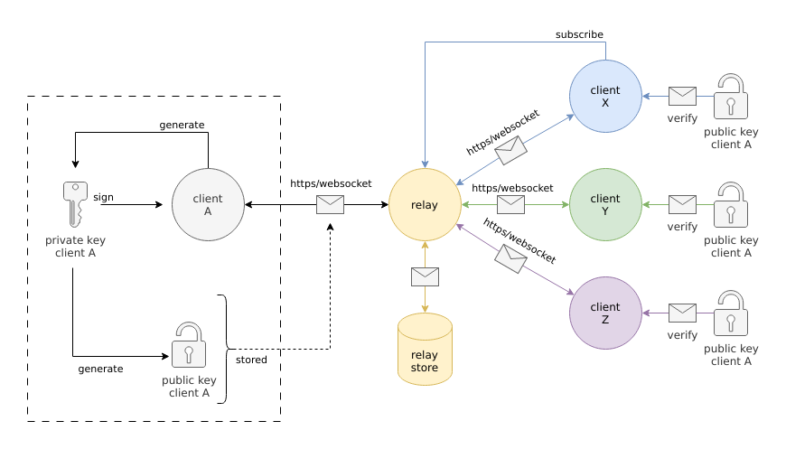
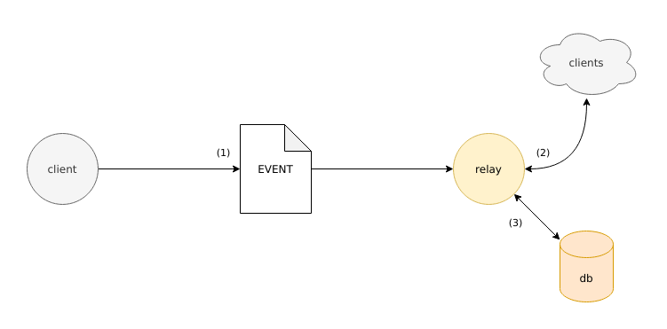
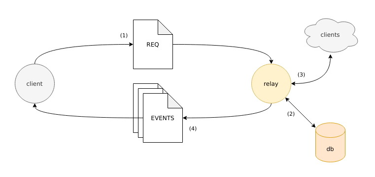
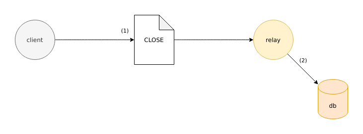
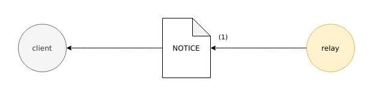

---

This article has been redacted in February and March 2023. It
describes the methodologies applied and describe the methods used to
implement the first NIP from nostr protocol in Erlang with a minimal
amount of dependencies. The following code has been tested using
[Erlang/OTP R25](https://www.erlang.org/news/157) running on
[OPENBSD-72-CURRENT](openbsd.org/) and [Parrot
Linux](https://parrotsec.org/) (a Debian like distribution).

# Nostr NIP/01 Library Design and Implementation

NIP/01[^nip-01-specification] is the first NIP describing the nostr
protocol. This is a mandatory specification defining the basic
data-structures and how relays and clients communicate together.



## HTTP and Websocket

nostr protocol is mainly using Websocket[^wikipedia-websocket] over
HTTPS[^wikipedia-http] connection. The messages, called events, are
using JSON[^wikipedia-json] objects and directly pushed/pulled to/from
the active Websocket connection. A relay is acting as a classical HTTP
server, accepting only allowing Websocket connection. When using a
relay, the simplified procedure looks like the following one:

 1. Listen to a defined port usually TCP/80 (HTTP) or TCP/443 (HTTPS);

 2. When a client connects to the socket, initialize a Websocket
    end-point;

 3. Wait until the client is sending an Event;
 
 4. Forwards messages if requests.
 
In other hand, the client is acting like any standard HTTP client, but
supporting only HTTP with Websocket connections. The connection
procedure is described below.

 1. Connect to a remote host on TCP/80 (HTTP) or TCP/443 (HTTPS);

 2. When the HTTP connection is ready, ask for a Websocket connection;

 3. When the websocket is ready, subscribes to events or sends events.

The client authentication is done with cryptographic functions, in
particular the Schnorr signature
scheme[^schnorr-signature-scheme]. Each messages are delivered with a
public key and a signature, this last element is generated by the
client with its own private key.

When the message is forwarded to other clients, the public key is used
to ensure the message was correctly created by the correct
client. This feature can also be used to send encrypted direct
message, a feature defined in NIP/04[^nip-04-specification].

## Client JSON Payloads

Clients and Relays are using JSON data-structures to communicate
together. In this part of the article, a non randomized private key
will be used:
`0000000000000000000000000000000000000000000000000000000000000001` and
its public key is
`79be667ef9dcbbac55a06295ce870b07029bfcdb2dce28d959f2815b16f81798`. Few
keys should not be used in the wild, this one is probably a good
example. **This key pair should be used only for testing and
development purpose**.

### Event Creation and Diffusion

The goal of nostr is to offer a simple way to diffuse textual content,
like Twitter or Mastodon. Those messages are called events and are
usually generated by the client and sent to the server using an
`Event` object.



The procedure is extremely easy, after a successful connection to the
relay, the client can directly send a message to the relay. The relay
can store it and/or relay the event to other clients if they have a
subscription.

The event sent is a JSON array, where the first element is a string
`"EVENT"`. The second element is a JSON object containing 7
attributes.

The `content` attribute contains the message sent by the client and
must be a valid UTF8 string.

The `created_at` attribute
defines the event creation date as POSIX timestamp, in other word, a
positive integer.

The `id` attribute is an identifier generated using a SHA256 checkums
of a serialized version of the event, it should be unique, is
represented as a lowercase hexadecimal string and has a fixed size,
256bits or 32bytes for the raw unencoded content, 64bytes or 512bits
for the hexadecimal string.

The `kind` attribute defines the kind of the event, and is a positive
integer. NIP/01 defines 3 kinds: `set_metadata` using `0`, `text_note`
using `1` and `recommend_server` using `2`.

The `pubkey` attributes shares the public key of the client. This is a
lowercase hexadecimal string representing a secp256k1 public key, its
size is fixed to 64bytes or 512bits for its hexadecimal representation
and 256bits or 32bytes for its raw unencoded version.

The `sig` attribute represents the signature of the event. This
element is generated by signing the SHA256 hash of the serialized form
of the event with the private key on the client side, in other word,
it signs the event identifier of the event. This is a lowercase
hexadecimal string with a fixed size of 128bytes or 1024bits in its
hexadecimal encoded form and 64bytes or 512bits for its raw unencoded
format.

The `tags` attribute can store tags. A tag is an array of string used
to extend the event data-structure. NIP/01 defines 2 tags: `e` tag is
representing another event, used to "quote", `p` tag is representing
someone else public key. A `tags` attribute can be set as an empty
array.

Here an example of a raw object generated by a client:

```json
["EVENT", {
  "content": "test",
  "created_at": 1678325509
  "id": "f986c724a5085ffe093e8145ef953ed5c9d3d20f1c0e7fa3b88bfa5eb96427c6",
  "kind": 0,
  "pubkey": "79be667ef9dcbbac55a06295ce870b07029bfcdb2dce28d959f2815b16f81798",
  "sig": "140d53496710b06dbc8ce239a454bf48defd31c1067927e236271f5565b72f6888c
1098f947e7b5a099c909c046d705e9031e990b5df705b15640858a94f528e",
  "tags": []
}]
```

`nostrlib` has been created to encode and decode these events using
records `#event{}` defined in `nostrlib.hrl`:

```erlang
-record(event, { id         = undefined :: decoded_event_id()
               , public_key = undefined :: decoded_public_key()
               , created_at = undefined :: decoded_created_at()
               , kind       = undefined :: decoded_kind()
               , tags       = []        :: decoded_tags()
               , content    = undefined :: decoded_content()
               , signature  = undefined :: decoded_signature()
               }).
```

All hexadecimal string are decoded and are stored as bitstring. The
created_at field is using the `universaltime` representation. The kind
field is using atom to represent the kind of the event instead of an
integer. Finally, the tags are represented by the `#tag{}` record,
also defined in `nostrlib.hrl` file:

```erlang
-record(tag, { name   = undefined :: public_key | event_id
             , value  = undefined :: undefined | bitstring()
             , params = []        :: list()
             }).
```

Two functions can be used to encode events, `nostrlib:encode/1` and
`nostrlib:encode/2`. These functions are returning a tuple containing
the JSON data encoded as bitstring.

```erlang
rr(nostrlib).
{ok, EncodedEvent} = nostrlib:encode(#event{}).
```

To decode a message, two functions exist as well: `nostrlib:decode/1`
and `nostrlib:decode/2`. These two functions are returning a tuple
containing the event as record and a label. This last element gives an
idea of the "quality" of the event by alerting the developer/user if
the event has been correctly signed or if the identifier is using its
strict form (or not).

```erlang
{ok, DecodedEvent, Labels} = nostrlib:decode(EncodedEvent).
```

Now the low level interfaces have been created, high level interfaces
can be created. Only the client must be able to send those kind of
event, then, the functions should be defined in `nostr_client` module.

```erlang
{ok, Info} = nostr_client:event(Connection, Kind, Content).
{ok, Info} = nostr_client:event(Connection, set_metadata, #{ <<"about">> => <<"data">> }).
{ok, Info} = nostr_client:event(Connection, text_note, <<"my message to the world">>).
{ok, Info} = nostr_client:event(Connection, recommend_server, <<"wss://relay.com/">>).
```

#### Event Identifier Creation

As seen in the previous section, the event identifier is created by
applying the SHA256 hash function on a serialized version of the
event. This data-structure is created by creating a new JSON array
with the different attributes:

```json
[0,$public_key,$created_at,$kind,$tags,$content]
```

Where

 - `$public_key` is the public key derived from the private key;

 - `$created_at` is the date of the creation of the event, in POSIX
   format (integer);

 - `$kind` is the kind of the event as integer;

 - `$tags` is a list of tags, usually strings;

 - `$content` is the content of the message, as string.

The event example seen in the previous section will have the following
serialized format (without spaces and carriage returns):

```json
[0
,"79be667ef9dcbbac55a06295ce870b07029bfcdb2dce28d959f2815b16f81798"
,1678325509
,0
,[]
,"test"
]
```

This implementation is creating automatically the event identifier
when all the attributes are correctly set but if the readers are
curious, the functions used to serialize an event are
`nostrlib:serialize/1` and `nostrlib:serialize/5`. The function used
to create an event identifier is `nostrlib:create_id/1`. Both of them
are private and can only be view in the `nostrlib.erl` file.

#### Signature Creation and Validation

A signature is created using the Schnorr signature scheme. The message
to sign the event identifier or the serialized version of the
event. Any events can be signed using `nostrlib:sign/1` function, this
one is based on both `nostrlib_schnorr:sign/2` and
`nostrlib_schnorr:sign/3` functions.

```erlang
nostrlib:sign(Event).
nostrlib_schnorr:sign(Message, PrivateKey).
```

To verify if a signature is valid, the function `nostrlib:verify/1`
can be used on any decoded event. It will return if the message has
been correctly signed. Its a wrapper around
`nostrlib_schnorr:verify/3` function.

```erlang
nostrlib:verify(Event).
```

### Requesting a New Subscription

By default, a relay does not send any event. A client must ask for
different kind of events with a request. The request is a special
message defining a subscription id, a random string created by the
client, and a list of filters. The filter is used by the relay to look
on its database or from the new event and forward them to the client.



The filter is defined has a JSON objects containing 8 optional
fields. The `ids` field is containing a list of event ids or prefixes
represented as lowercase hexadecimal strings. These values are used by
the relay to filter the events by their event identifier.

The `authors` field is containing a list of public keys or prefixes
represented as lower case hexadecimal strings. Those values are used
by the relay to filter the events by the public key of the authors.

The `#e` attribute is containing a list of event identifiers, in their
strict format. The behavior is similar than the one provided by the
`ids` attribute.

The `#p` attribute is containing a list of public keys, in their
strict format. The behavior is similar than the one provided by the
`authors` attribute.

The `since` and `until` attributes are used to define a date interval,
when `since` define the beginning of the interval and `until` defines
its end. Both are represented as positive integer and using the POSIX
date/time format.

The `limit` attibute defines how many event the relay is allowed to
send during the first request.

```json
["REQ", "client1_subscription_kxFgDz4y", {
  "ids": [
    "f986c724a5085ffe093e8145ef953ed5c9d3d20f1c0e7fa3b88bfa5eb96427c6",
    "f986c724a5085ffe093e8145"
  ],
  "authors": [
    "79be667ef9dcbbac55a06295ce870b07029bfcdb2dce28d959f2815b16f81798",
    "79be667ef9dcbbac55a06295ce870b"
  ],
  "#e": [
    "f986c724a5085ffe093e8145ef953ed5c9d3d20f1c0e7fa3b88bfa5eb96427c6"
  ],
  "#p": [
    "79be667ef9dcbbac55a06295ce870b07029bfcdb2dce28d959f2815b16f81798"
  ],
  "since": 1678325509,
  "until": 1678325509,
  "limit": 10
}]
```

`nostrlib` represents these elements with 2 records, `#request{}` and
`#filter{}` both defined in `nostrlib.hrl` file.

```erlang
-record(filter, { event_ids       = [] :: decoded_event_ids()
                , authors         = [] :: decoded_authors()
                , kinds           = [] :: decoded_kinds()
                , tag_event_ids   = [] :: decoded_tag_event_ids()
                , tag_public_keys = [] :: decoded_tag_event_public_keys()
                , since           = undefined :: decoded_since()
                , until           = undefined :: decoded_until()
                , limit           = undefined :: decoded_limit()
                }).
-record(request, { subscription_id = undefined :: decoded_subscription_id()
                 , filter = #filter{} :: [decoded_filter(), ...]
                 }).
```

`nostrlib:encode/1` or `nostrlib:encode/2` functions are being used to
encode a request.

```erlang
rr(nostrlib).
Filter = #filter{}.
SubscriptionId = nostrlib:new_subscription_id().
{ok, Request} = nostrlib:encode(#request{ subscription_id = SubscriptionId
    , filter = Filter }).
```

`nostrlib:decode/1` or `nostrlib:decode/2` functions are used to
decode the encoded JSON.

```erlang
{ok, Decoded, Labels} = nostrlib:decode(Request).
```

Only a client is allowed to send a request to a
relay. `nostr_client:request/2` is then created as a high level
interface.

```
{ok, SubscriptionId} = nostr_client:request(Connection, Filter).
```

### Close an Active Subscription

An active subscription can be closed on demand by the client. The
relay will remove the subscription on its side and stop relaying the
event to the subscriber.



```json
["CLOSE", "client1_subscription_kxFgDz4y"]
```

Close event is represented with `#close{}` record defined in
`nostrlib.hrl` file.

```erlang
-record(close, { subscription_id = undefined :: decoded_subscription_id()
               }).
```

As usual, the `nostrlib:encode/1` or `nostrlib:encode/2` functions can
be used to generated the JSON payload.

```erlang
rr(nostrlib).
{ok, EncodedClose} = nostrlib:encode(#close{ subscription_id = SubscriptionId }).
```

Close events can also be decoded using `nostrlib:decode/1` and
`nostrlib:decode/2` functions.

```erlang
{ok, Decoded, Labels} = nostrlib:decode(EncodedClose).
```

This event can only be sent by a client, then the function
`nostrlib_client:close/2` can be used to terminate a subcription.

```erlang
nostr_client:close(Connection, SubscriptionId).
```

## Relay JSON Payloads

This part of the code should be treated as a draft. Indeed, at this
time of writing, the nostr relay is not implemented and the present
data-structures and algorithms could change in the future.

The client is sending its messages to a relay, but the relay can also
sent back its own message, in particular the events created by other
clients. Relays, like defined in NIP/01, are really simple.

### Event Forwarding

When a client is sending a message to a relay, the relay will check
the subscriptions, if a subscription match the event, then it is
forwarded to the client asking for this kind of events. Relays can
also store all events in its own database.


The example event generated on the client part will look like the
following JSON object on other client, after being forwarded by the
relay. The only added element is the `"subscription_id"` string, and
is the subscription id generated a client.

```json
["EVENT", "client1_subscription_kxFgDz4y", {
  "content": "test",
  "created_at": 1678325509
  "id": "f986c724a5085ffe093e8145ef953ed5c9d3d20f1c0e7fa3b88bfa5eb96427c6",
  "kind": 0,
  "pubkey": "79be667ef9dcbbac55a06295ce870b07029bfcdb2dce28d959f2815b16f81798",
  "sig": "140d53496710b06dbc8ce239a454bf48defd31c1067927e236271f5565b72f6888c
1098f947e7b5a099c909c046d705e9031e990b5df705b15640858a94f528e",
  "tags": []
}]
```

A forwarded event is called a subscription in this
implementation. This name will probably be changed in a near future
because it could be confused with a request and/or other events. The
record used is called `#subscription{}`.


```erlang
-record(subscription, { id      = undefined :: decoded_subscription_id()
                      , content = undefined :: decoded_subscription_content()
                      }).
```

The subscription event can only be used by a relay, and should be
defined in `nostr_relay` module. The function will be called
`nostr_relay:event/2`, where the first argument will be a subcription
id (connected to a client) and the second argument will be the event
to forward.

```erlang
ok = nostr_relay:event(Subscription, Event).
```

### Notice Message

Relays can send direct messages to one or more client. This feature is
used to inform a client of something happening on the server.



The JSON object used is a simple array, with the first element set to
a string `"NOTICE"` and the second element is a valid unicode string.

```json
["NOTICE", "message from the relay"]
```

The record used internally is called `#notice{}`. 

```erlang
-record(notice, { message = undefined :: decoded_message() }).
```

A relay should have the possibility to send a message to one or many
users connected to the service. In this case, the function
`nostr_relay:notice/2` should created. The first argument will be a
connection, a list of connections or a special value like the atom
`all` used to contact, one, many or all users. The second argument
will be the message to send as a bitstring.

```erlang
ok = nostr_relay:notice(all, <<"my message">>).
ok = nostr_relay:notice([C1, C2, C3], <<"my message">>).
ok = nostr_relay:notice(Connection, <<"my message">>).
```

## Event Kinds Concept

An event sent by a client can be set with a kind. At this time, in
NIP/01, only 3 kinds have been defined. This feature extend the
concept of event by specifying what kind of data will be contained in
the `content` field.

Events using the kind `0` or `set_metadata` will be behave like a
profile page on classical social networks. The content will be
interpreted as a JSON object containing, by default, 3 attributes are
available:

 - `name` attribute defines the name of the user as a string;
 
 - `about` attribute allows to set a description about the user;
 
 - `picture` attribute should be set with an URL pointing to an image.

Events using the kind `1` or `text_notes` will behave like a plaintext
messages. The content field will be interpret as a simple string.

Finally, events using the kind `2` or `recommend_server` will have the
content attribute set to a valid URL pointing to a prefered server.

| kind id | kind name          | description         | example                       |
|---------|--------------------|---------------------|-------------------------------|
| `0`     | `set_metadata`     | a stringified json  | `"{\"about\":\"hello\",\"name\":\"myname\",...}"`
| `1`     | `text_note`        | a plaintext message | `"this a text message"` |
| `2`     | `recommend_server` | an URL              | `"wss://my.cool.server.com/"` |

## Subscription Concept

A client can ask a relay to have events. The client is in charge of
generating a subscription id (a random string) and a filter to receive
events. At this time, this feature is not implemented, but an instance
of the subscription should be available on the server side, identified
by an unique id.

# Connecting the Dots

The functions `nostrlib:encode/1` and `nostrlib:encode/2` are used to
encode a message using a record and convert them in a JSON payload.

```erlang
{ok, Encoded} = nostrlib:encode(Event).
{ok, Encoded} = nostrlib:encode(Event, Opts).
```

The functions `nostrlib:decode/1` and `nostrlib:decode/2` are used to
decode a JSON object and convert them into an Erlang term, like a
record.

```erlang
{ok, Decoded, Labels} = nostrlib:decode(JSON_Message)
{ok, Decoded, Labels} = nostrlib:decode(JSON_Message, Opts)
```

The functions `nostrlib:check/1` and `nostrlib:check/2` are checking
an event without decoding it. The raw message, if valid, is then
returned.

```erlang
{ok, JSON_Message, Labels} = nostrlib:check(JSON_Message).
{ok, JSON_Message, Labels} = nostrlib:check(JSON_Message, Opts).
```

The function `nostrlib:sign/2` is used to sign an event with a private
key. `nostrlib:verify/1` is used to verify the signature in an event
and be sure the message is valid.

```erlang
{ok, Signature} = nostrlib:create_signature(Event, PrivateKey).
{ok, Event} = nostrlib:sign(Event, PrivateKey).
true = nostrlib:verify(Event).
true = nostrlib:verify(EventId, PublicKey, Signature).
```

`nostrlib:new_subscription_id/0` is used to generate a new
subscription id, mainly used by the client.

```erlang
SubscriptionId = nostrlib:new_subscription_id().
```

`nostrlib:check_hex/1` and `nostrlib:is_hex/1` are used to ensure an
element is correctly using an hexadecimal format.

```erlang
{ok, <<"abcd">>} = nostrlib:check_hex(<<"abcd">>).
{error, _} = nostrlib:check_hex(<<"zabcd">>).
true = nostrlib:is_hex(<<"abcd">>).
false = nostrlib:check_hex(<<"zabcd">>).
```

`nostrlib:integer_to_hex/1` and `nostrlib:hex_to_integer/1` are used
to convert integers to hexadecimal strings.

```erlang
<<"7b">> = nostrlib:integer_to_hex(123).
123 = nostrlib:hex_to_integer(<<"7b">>).
```

`nostrlib:binary_to_hex/1` and `nostrlib:hex_to_binary/1` are used to
convert binary/bitstring to hexadecimal strings.

```erlang
<<"7b">> = nostrlib:binary_to_hex(<<123>>).
<<"{">> = nostrlib:hex_to_binary(<<"7b">>).
```

Functions present in `nostr_client` and `nostr_relay` modules are not
implemented and will not be presented here.

# Conclusion

In a bit more than 2 weeks, huge improvement were made. The
foundations have been created to welcome the next features. Like in
any other project, the beginning is probably one of the most complex
part. This project could have been started from different angles,
instead of starting by the client, the first step would have been to
start working on the relay, but it was not the case for some reasons:
the JSON objects are shared by the clients and the relay. That means
if the parser is working correctly as client, it will work correctly
as relay. It is less dangerous to create a client and break it locally
than deploying a relay into the wild.

---

[^wikipedia-websocket]: https://en.wikipedia.org/wiki/WebSocket
[^wikipedia-http]: https://en.wikipedia.org/wiki/HTTP
[^wikipedia-json]: https://en.wikipedia.org/wiki/JSON
[^nip-01-specification]: https://github.com/nostr-protocol/nips/blob/master/01.md
[^nip-04-specification]: https://github.com/nostr-protocol/nips/blob/master/04.md
[^schnorr-signature-scheme]: https://en.wikipedia.org/wiki/Schnorr_signature
